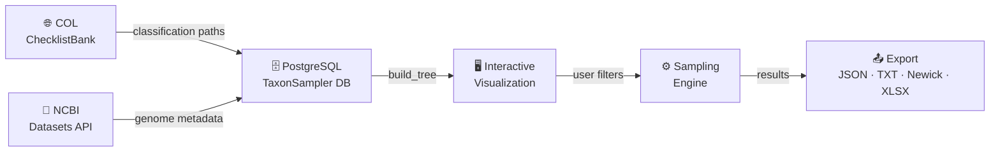
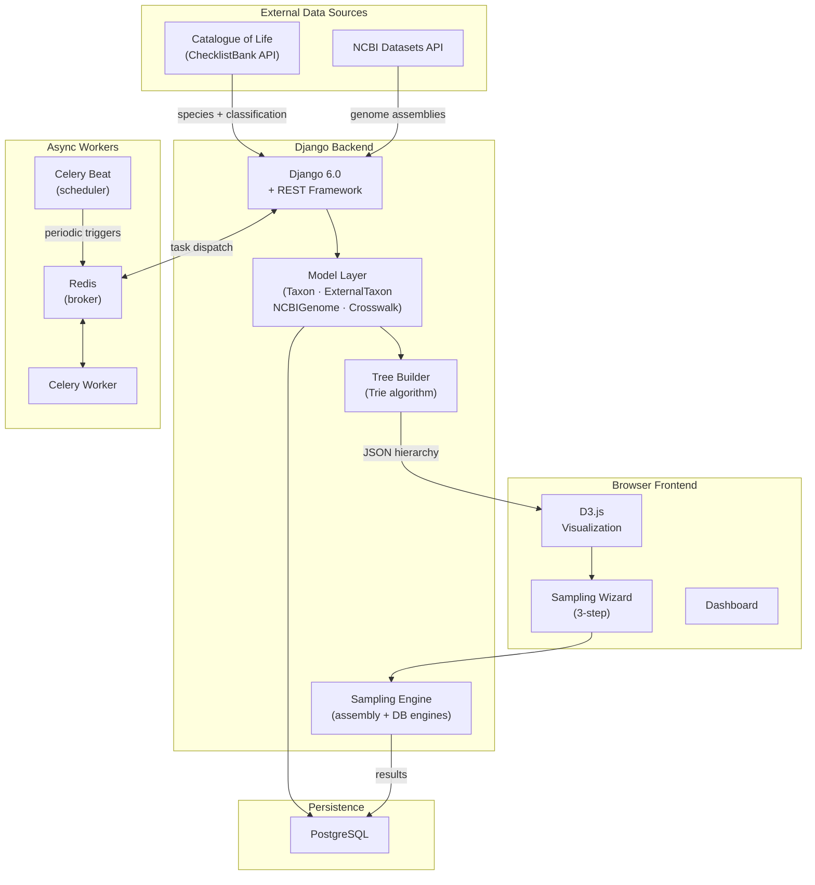
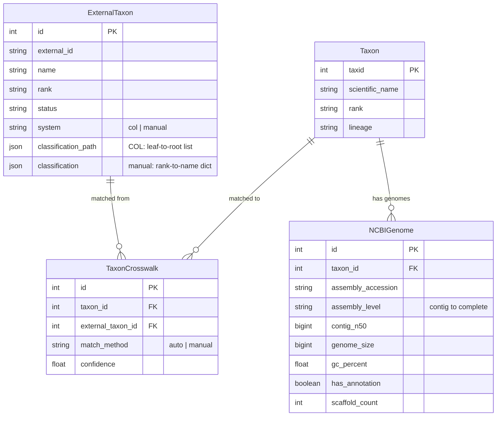
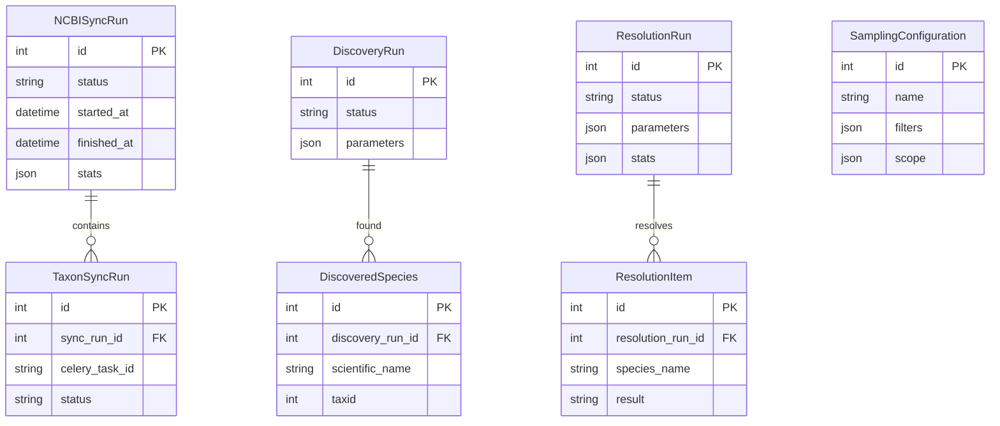
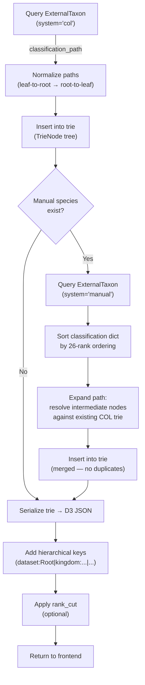
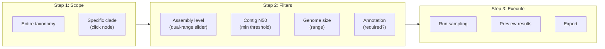
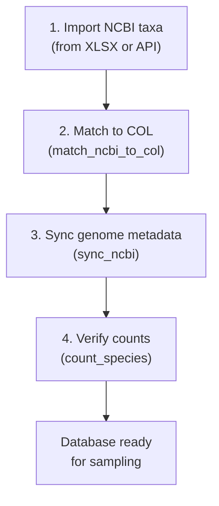
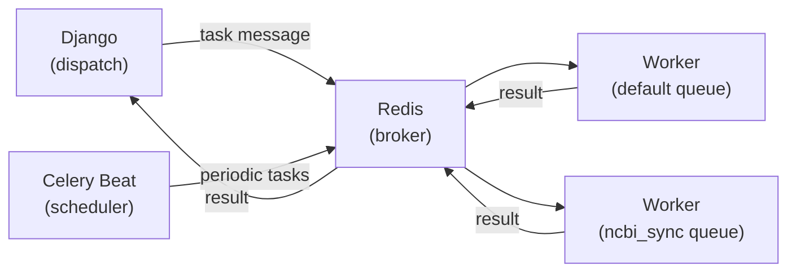

# TaxonSampler

[](https://www.python.org/downloads/)
[](https://www.djangoproject.com/)
[](https://docs.celeryq.dev/)
[](https://www.postgresql.org/)
[](https://d3js.org/)
[](https://www.ncbi.nlm.nih.gov/datasets/)
[](https://www.catalogueoflife.org/)
[](http://etetoolkit.org/)
[](LICENSE)

---

## Overview

**TaxonSampler** is an open-source web platform that integrates taxonomic classifications from the [Catalogue of Life (COL)](https://www.catalogueoflife.org/) with genome assembly metadata from the [NCBI Datasets API](https://www.ncbi.nlm.nih.gov/datasets/), providing researchers with an interactive environment to explore, filter, and sample species for comparative genomics, phylogenomics, and biodiversity studies.

The tool addresses a common bottleneck in large-scale genomic analyses: the manual and error-prone process of selecting species with available genome assemblies that meet specific quality criteria, while maintaining taxonomic representativeness across clades of interest.

---

## Motivation

Comparative genomic analyses frequently require assembling a representative subset of species from broad taxonomic groups. Two competing objectives must be balanced during this selection:

1. **Genome quality** — assemblies must meet minimum standards for contiguity (contig N50), completeness (assembly level), and annotation.
2. **Taxonomic coverage** — selected species should span the phylogenetic breadth of the target clade to avoid systematic sampling bias.

Performing this selection manually is time-consuming and prone to inconsistencies, particularly when hundreds or thousands of candidate species are involved. TaxonSampler automates the entire pipeline:



---

## Features

| Feature | Description |
|---|---|
| **Taxonomic integration** | Imports and reconciles species records from COL/ChecklistBank with NCBI taxonomy, storing full classification paths (domain → species) with 26+ taxonomic ranks. |
| **Genome metadata sync** | Automated retrieval of assembly-level metadata from NCBI Datasets: assembly level, contig N50, scaffold count, genome size, GC content, and annotation status. |
| **Interactive visualization** | D3.js-powered collapsible hierarchical display with breadcrumb navigation, clade search, real-time species counts, and zoom/pan. |
| **Sampling wizard** | Three-step guided workflow: (1) scope selection, (2) genome-quality filters with dual-range sliders, (3) execution and preview. |
| **Manual curation** | Add or edit species classifications when COL data is incomplete. Manual entries are automatically merged into the existing COL hierarchy via trie path resolution. |
| **Multi-format export** | Export sampled species as JSON, plain text, Newick (ETE3), or Excel (XLSX) with genome metadata columns. |
| **Background processing** | Celery + Redis for async NCBI sync, species discovery, and batch sampling with scheduled jobs via Celery Beat. |
| **Dashboard** | Overview panel with species counts, genome coverage statistics, sync history, and recent activity. |

---

## System Architecture

### High-level architecture



### Technology stack

| Layer | Technology | Role |
|---|---|---|
| Backend | Django 6.0, Django REST Framework 3.16 | Web server, API, ORM |
| Language | Python 3.13 | Application logic |
| Task queue | Celery 5.4 + Redis | Async task execution and scheduling |
| Database | PostgreSQL | Persistent storage |
| Frontend | Bootstrap 5 (Tabler), D3.js v5, ES Modules | UI, interactive visualization |
| Phylogenetics | ETE3 3.1 | Newick tree generation |
| Spreadsheet I/O | openpyxl 3.1 | XLSX import and export |

---

## Data Model

The relational schema bridges two taxonomic authorities (NCBI and COL) through a crosswalk table, and links genome assembly metadata to each taxon:



### Supporting models



---

## Taxonomy Construction Algorithm

The taxonomic hierarchy is constructed as a **trie** (prefix tree) from the database records, then serialized to a D3.js-compatible JSON format.

### Pipeline



### Why trie-based merging matters

Consider a manual species *Chelonoidis abingdonii* with classification `{phylum: Chordata, subphylum: Vertebrata, class: Reptilia, ...}`. The COL hierarchy for reptiles includes intermediate ranks not present in the manual record:

```
COL path:     Chordata → Vertebrata → Gnathostomata → Osteichthyes → Tetrapoda → Reptilia
Manual path:  Chordata → Vertebrata → Reptilia  (missing 3 intermediate ranks)
```

Without merging, this would create **two separate "Reptilia" branches**. The `_expand_manual_path()` function resolves this by searching the existing trie for each target node and filling in intermediate COL nodes automatically:

```
Merged path:  Chordata → Vertebrata → Gnathostomata → Osteichthyes → Tetrapoda → Reptilia ✓
```

---

## Sampling Workflow

The sampling process follows a three-step wizard:



**Genome quality levels** used for filtering:

| Level | Assembly Level | Description |
|---|---|---|
| 1 | Scaffold | Contigs joined into scaffolds |
| 2 | Chromosome | Assembled to chromosome level |
| 3 | Complete Genome | Fully assembled genome |

---

## Installation

### Prerequisites

| Requirement | Minimum version |
|---|---|
| Python | ≥ 3.13 |
| PostgreSQL | ≥ 14 |
| Redis | ≥ 7.0 |

### Setup

# Create and activate a virtual environment
python -m venv .venv
# Windows PowerShell:
& .\.venv\Scripts\Activate.ps1
# Linux / macOS:
source .venv/bin/activate

# Install dependencies
pip install -r requirements.txt
```

### Configuration

Create a `.env` file in the `taxbridge/` directory:

```env
DJANGO_SECRET_KEY=<secret-key>
DJANGO_DEBUG=True
DJANGO_ALLOWED_HOSTS=localhost,127.0.0.1
DATABASE_URL=postgres://<user>:<password>@localhost:5432/taxonsampler
CELERY_BROKER_URL=redis://localhost:6379/0
CELERY_RESULT_BACKEND=redis://localhost:6379/0
NCBI_API_KEY=<your-ncbi-api-key>
```

> **Note:** An NCBI API key can be obtained free of charge at [ncbi.nlm.nih.gov/account/settings](https://www.ncbi.nlm.nih.gov/account/settings/).

### Database initialization

```bash
cd taxbridge
python manage.py migrate
python manage.py createsuperuser
python manage.py collectstatic --noinput
```

### Start the application

```bash
python manage.py runserver 0.0.0.0:8000
```

The application will be available at `http://localhost:8000/taxonomy/`.

---

## Data Import Pipeline

The recommended order for initial data population:



| Step | Command | Description |
|---|---|---|
| 1a | `python manage.py import_ncbi_from_xlsx <file>` | Import NCBI taxa from an XLSX spreadsheet |
| 1b | `python manage.py import_genomes_from_xlsx <file>` | Import genome records from XLSX |
| 1c | `python manage.py import_research_genomes <file>` | Import research genome data and match with COL |
| 2 | `python manage.py match_ncbi_to_col` | Match NCBI taxa to COL and create crosswalk entries |
| 3a | `python manage.py sync_ncbi` | Sync genome assemblies from NCBI Datasets API |
| 3b | `python manage.py sync_col_matches` | Synchronize NCBI taxa with COL |
| 4 | `python manage.py count_species` | Report species counts in NCBI and COL |

---

## Celery Task Queue

Long-running operations run asynchronously via Celery with Redis as the message broker.

### Architecture



### Commands

```bash
cd taxbridge

# Start the Celery worker (both queues)
celery -A config worker -l info -Q default,ncbi_sync

# Start the scheduler (triggers periodic tasks)
celery -A config beat -l info

# Combined worker + scheduler (development only)
celery -A config worker -B -l info -Q default,ncbi_sync

# Web-based task monitor (optional)
pip install flower
celery -A config flower --port=5555
```

### Scheduled tasks

| Task | Schedule | Queue | Description |
|---|---|---|---|
| `sync_ncbi_genomes` | Daily, 03:00 | `ncbi_sync` | Fetch updated genome metadata from NCBI |
| `cleanup_old_sync_runs` | Weekly, Sun 04:00 | `default` | Purge old synchronization records |
| `discover_new_species` | Weekly, Mon 05:00 | `ncbi_sync` | Discover species in NCBI absent from the local database |

### Configuration reference

| Setting | Default | Description |
|---|---|---|
| `CELERY_BROKER_URL` | `redis://localhost:6379/0` | Redis broker connection URL |
| `CELERY_RESULT_BACKEND` | `redis://localhost:6379/0` | Where task results are stored |
| `CELERY_TASK_TIME_LIMIT` | `3600` (1 hour) | Maximum execution time per task |
| `CELERY_TASK_DEFAULT_QUEUE` | `default` | Default queue for unrouted tasks |

---

## Export Formats

| Format | Content | Use case |
|---|---|---|
| **JSON** | Full metadata (species, genome, classification) | Programmatic downstream analysis |
| **TXT** | Plain-text species list (one per line) | Quick reference, input for other tools |
| **Newick** | Phylogenetic tree string (via ETE3) | Tree viewers (FigTree, iTOL, R/ape) |
| **XLSX** | Spreadsheet with genome metadata columns | Sharing with collaborators, manual review |

---

## Directory Structure

```
taxbridge/                         # Django project root
├── manage.py
├── config/
│   ├── settings/
│   │   ├── base.py                # Shared settings (DB, Celery, APIs)
│   │   ├── local.py               # Development overrides
│   │   └── prod.py                # Production settings
│   ├── celery.py                  # Celery application & scheduled tasks
│   ├── urls.py                    # Root URL routing
│   └── wsgi.py / asgi.py
├── apps/
│   └── taxonomy/                  # Core application
│       ├── models/
│       │   ├── core.py            # Taxon, ExternalTaxon, TaxonCrosswalk
│       │   ├── genome.py          # NCBIGenome
│       │   ├── sync.py            # Sync and discovery audit models
│       │   └── sampling.py        # Sampling models
│       ├── managers.py            # Trie-based tree builder
│       ├── ncbi/
│       │   ├── service.py         # NCBI Datasets API client
│       │   ├── tasks.py           # Celery tasks (sync, discovery)
│       │   └── views.py           # NCBI-related endpoints
│       ├── sampling/
│       │   ├── service.py         # Sampling orchestration
│       │   ├── assembly_engine.py # Assembly-level filtering
│       │   └── db_engine.py       # Database-backed sampling
│       ├── api/                   # REST API endpoints
│       ├── dashboard/             # Dashboard views
│       ├── tree/                  # Visualization logic & filters
│       ├── management/commands/   # CLI import/sync commands
│       ├── templates/             # HTML (Tabler/Bootstrap)
│       └── static/taxonomy/       # CSS, JS, images
└── requirements.txt
```

---

## Development

```bash
cd taxbridge

# Run the test suite
python manage.py test

# Interactive Django shell
python manage.py shell

# Create migrations after model changes
python manage.py makemigrations

# Apply migrations
python manage.py migrate

# Validate deployment readiness
python manage.py check --deploy
```


### Frontend development

- Static assets: `taxbridge/apps/taxonomy/static/taxonomy/` (CSS, JS, images).
- JavaScript uses ES Modules (`import`/`export`).
- After modifying static files: `python manage.py collectstatic --noinput`.
- Browser cache bypass: `Ctrl+Shift+R`.

---

## Contributing

Contributions are welcome. Please open an issue to discuss proposed changes before submitting a pull request. Ensure that all tests pass and that new functionality includes appropriate test coverage.

---

## License

This project is released under the [MIT License](LICENSE).

---

## Citation

If you use TaxonSampler in your research, please cite:

```bibtex
@software{taxonsampler2026,
  author       = {Izquerdo, Joan},
  title        = {{TaxonSampler}: A web platform for taxonomic sampling
                  and genome data integration},
  year         = {2026},
  url          = {https://github.com/<user>/TaxonSampler},
  note         = {Software available at \url{https://github.com/<user>/TaxonSampler}}
}
```

---

## Contact

For questions, bug reports, or feature requests, please open an issue on the GitHub repository or contact the maintainers directly.
